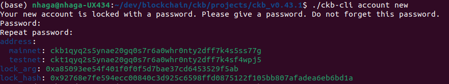
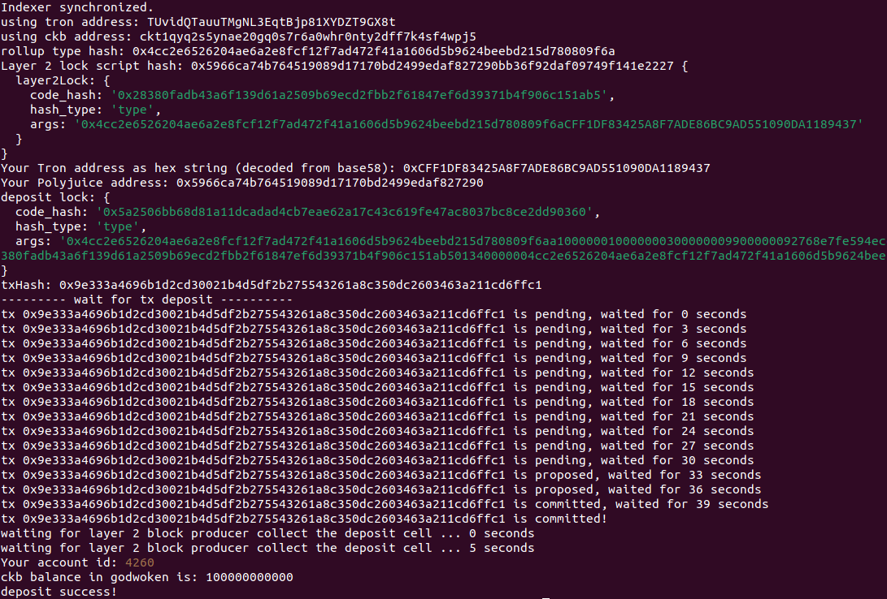
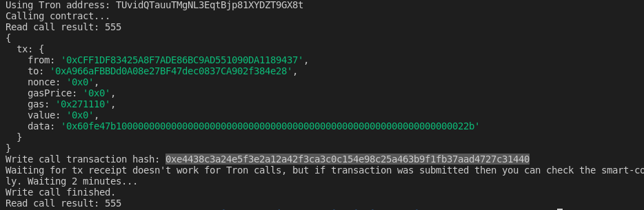

Nervos gitcoin hackathon

# Task - 11

1. A screenshot of the accounts you created (account list) in ckb-cli.



2. A link to the Layer 1 address you funded on the Testnet Explorer.

https://explorer.nervos.org/aggron/address/ckt1qyq2s5ynae20gq0s7r6a0whr0nty2dff7k4sf4wpj5

3. A screenshot of the console output immediately after you have successfully submitted a CKByte deposit to your Tron account on Layer 2.

   

4. A screenshot of the console output immediately after you have successfully issued a smart contract calls on Layer 2.

   

5. The transaction hash of the "Contract call" from the console output (in text format).

   `0xe4438c3a24e5f3e2a12a42f3ca3c0c154e98c25a463b9f1fb37aad4727c31440`

6. The contract address that you called (in text format).

   `0xA966aFBBDd0A08e27BF47dec0837CA902f384e28`

7. The ABI for contract you made a call on (in text format).

```
[
    {
      "inputs": [],
      "stateMutability": "payable",
      "type": "constructor"
    },
    {
      "inputs": [
        {
          "internalType": "uint256",
          "name": "x",
          "type": "uint256"
        }
      ],
      "name": "set",
      "outputs": [],
      "stateMutability": "payable",
      "type": "function"
    },
    {
      "inputs": [],
      "name": "get",
      "outputs": [
        {
          "internalType": "uint256",
          "name": "",
          "type": "uint256"
        }
      ],
      "stateMutability": "view",
      "type": "function"
    }
  ]
```

8. Your Tron address (in text format).

   TUvidQTauuTMgNL3EqtBjp81XYDZT9GX8t
