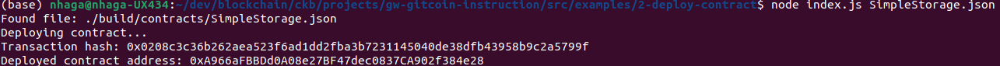

Nervos gitcoin hackathon

# Task - 2

1. A screenshot of the console output immediately after you have successfully deployed a smart contract.

2. The transaction hash from the contract deployment (in text format).

   0x0208c3c36b262aea523f6ad1dd2fba3b7231145040de38dfb43958b9c2a5799f

3. The deployed contract address from the contract deployment (in text format).

   0xA966aFBBDd0A08e27BF47dec0837CA902f384e28
