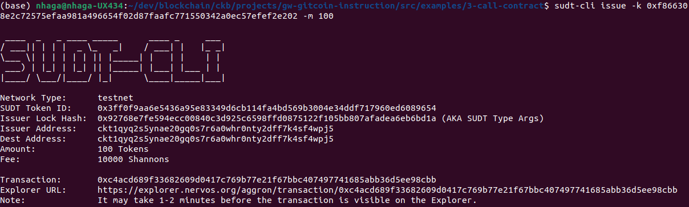
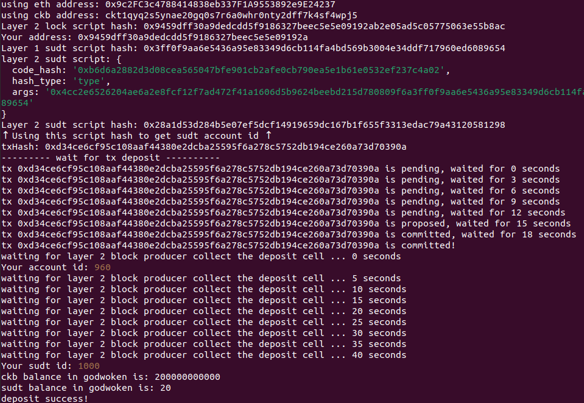

Nervos gitcoin hackathon

# Task - 4

1. A link to the Layer 1 address you funded on the Testnet Explorer.

   https://explorer.nervos.org/aggron/address/ckt1qyq2s5ynae20gq0s7r6a0whr0nty2dff7k4sf4wpj5

2. A screenshot of the console output immediately after using sudt-cli to create your SUDT tokens on Layer 1.

   

3. A link to the transaction ID created by sudt-cli on the Testnet Explorer.

   https://explorer.nervos.org/aggron/transaction/0xc4acd689f33682609d0417c769b77e21f67bbc407497741685abb36d5ee98cbb

4. A screenshot of the console output immediately after you have successfully submitted a deposit to Layer 2 using the account-cli tool.

   

5. The SUDT ID from the console output after executing the deposit script (in text format).

`sudt id: 1000`
