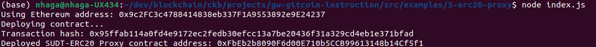
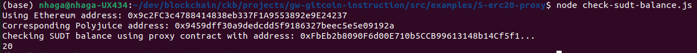

Nervos gitcoin hackathon

# Task - 5

1. A screenshot of the console output immediately after deploying smart contract.

   

2. The address of the ERC20 Proxy Contract you deployed (in text format).

   `0xFbEb2b8090F6d00E710b5CCB99613148b14Cf5f1`

3. A screenshot of the console output immediately after checking your SUDT balance.

   

4. The Ethereum address that was checked (in text format).

   `0x9c2FC3c4788414838eb337F1A9553892e9E24237`
