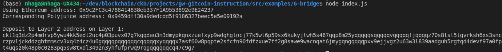

Nervos gitcoin hackathon

# Task - 6

1. A screenshot of the console output immediately after you have successfully generated your Deposit Receiver Address.

   

2. Your Deposit Receiver Address (in text format).

`ckt1q3dz2p4mdrvp5ywu4kk5edl2uc4p03puvx07g7kgqdau3n3dmypkqnxzuefxyp9wdghglncj77k5wt6p59sx6kukyjlwh5s467qgp8m25yqqqqqsqqqqqvqqqqqfjqqqqz70s8tst5lgvrksh6xs3sncrzpvljckddzghtmmscv3xq4z4cz4u6gqqqqpqqqqqqcqqqqqxyqqqqx7asf60w8pqpte2sfcfn90fdfzxue7ff2g8sawe9wacnqat6jmygqngqqqqpxv9ejjvgz2u63w3l839aadguh5rgtqd4devf97a0fpt4uqsz0k48p0c0z83pq5sw8txdl3492n3yhfufprwq9rqgqqqqqqcq47c9g7`

3. The Ethereum address used to generate the Deposit Receiver Address (in text format).

   `0x9c2FC3c4788414838eb337F1A9553892e9E24237`

4. A link to the Etherscan explorer for the successful Force Bridge transaction. This can be found on Force Bridge under History→Succeed.

   https://rinkeby.etherscan.io/tx/0x5ce58f32e94286d77bdea98cab1d33ef0751cd7e5df359879291fb16d31bb81e

5. A link to the Nervos explorer for the successful Force bridge transaction. This can be found on Force Bridge under History→Succeed.

   https://explorer.nervos.org/aggron/transaction/0x5cd0a7db70598dd6c3b09ad0614db11dcaa55cc860468150336ffa36a7e7e2a0
